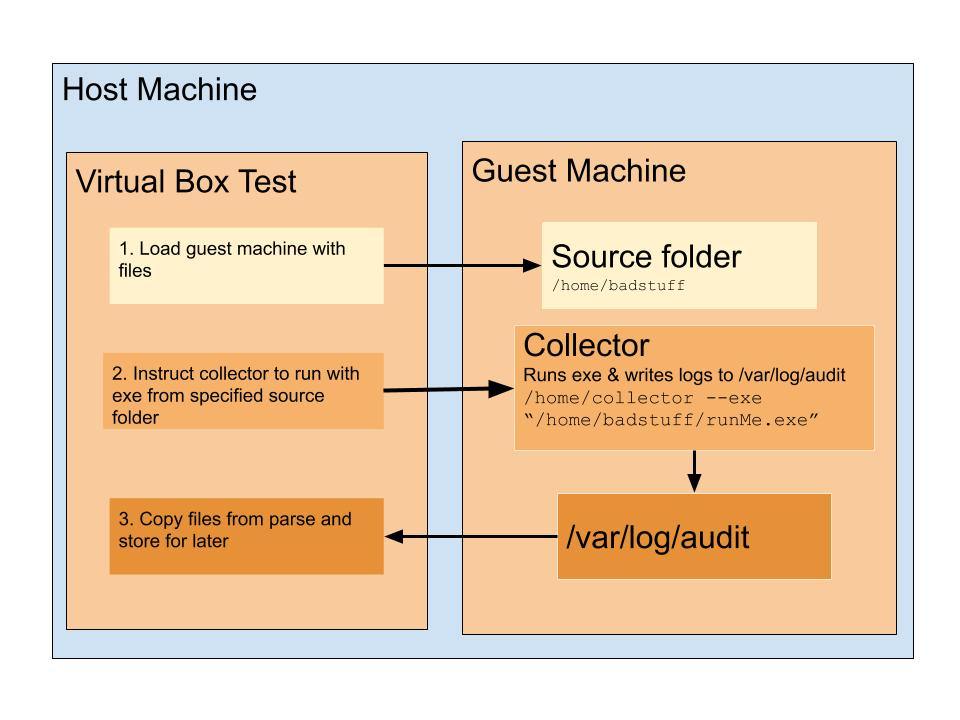

# vboxtest

# Virtual Box Tester README
***
This is a beta version. Not tested on Windows. Needs to be monitored in case of hanging.

A sample virtual appliance (deb9.ova) has been provided to get started. 


### INITIAL SET UP
1. Change directory to **vBoxTest/basic** folder
2. Install appliance on virtual box 
3. set **home folder and master_vm** in /basic/vbox.ini
4. Take a snapshot before loading.


#### vbox.ini sample file
```
***[linux/mac]***
home_dir = /home/carla/Desktop/mycpy/   # base folder of vboxtest
est_files = vboxtest/vBoxTest/audit     # where results go
bad_files = vboxtest/badstuff           # where compressed executables go
***[userVar]***
time = 5s                               # how long recording should take 1m
master_vm = deb9                        # name of the virtual machine you're using
```
### LOAD FILES ON TO VM
1. Compress viruses into zip folder
2. Placed zip in **bad_files** folder from vbox.ini
3. Run initialize.py with title of zip as argument
    *this copies folders to vm
    *then creates a list with all the file names
4. Take snapshot of clean virtual machine with loaded files

``./initialize Example_Viruses.zip``

### GENERATE LOGS
run ``./rawParse.py``

If configs are set up correctly... this is what happens:
For every file in fileList.txt:

1. Starts the virtual machine
2. Execute /home/collector on guest machine for x seconds.
    :-runs executable .
    -enerates logs in **/var/log/audit**.
3  . copy logs to test_files directory.
4. parses logs for syscalls and combines them into a gzip file.


## READ LOGS
glassbox/Glassbox1.1/API.py
##### processFileGzip(fpath_, wants)
fpath
 : is the file path of the gzip file
 
wants
 : list of wanted syscall properties to collect i.e. ['pid','syscall','exe'] 

### CLEAN UP
Restore the original snapshot of the virtual machine.
From there you can load files and run rawParse again.

### SET UP GUEST MACHINE
The guest machine must have Go, Python, and auditctl installed. 
Use the install script in /glassbox1.1/collector/ to get it set up. 

Copy the collector binary (collectorSource) and config file (go-audit.yaml) into /home/ on the guest machine.

They are found in vBoxTest/collectorSource.

### KNOWN ISSUES

Reading logs can hang especially if the files are too large.
Consider changing the audit configuration log to reduce the file size or copying over a script to parse it before sending it back. 
Also considering working on using /bin/cat to read log files and parse them through standard out instead of copying log files and parsing them. 


***

